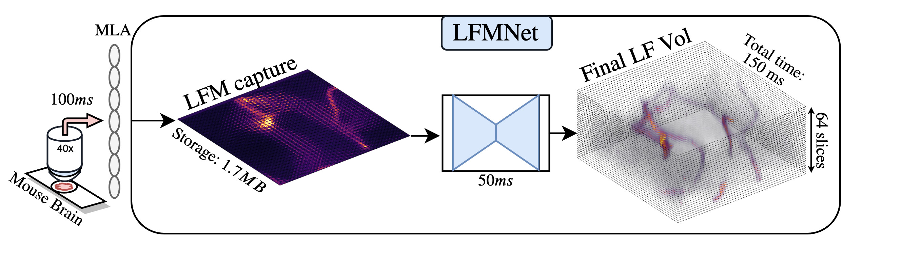
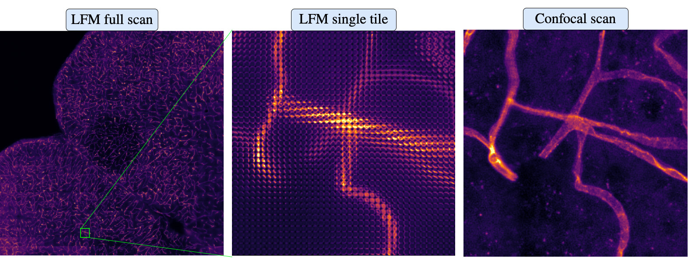
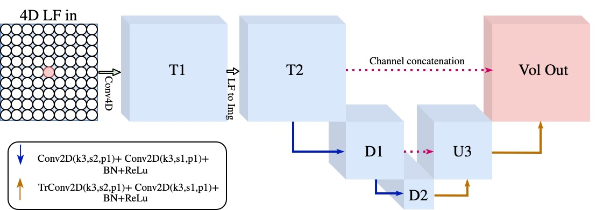

<!--- [![Forks][forks-shield]][forks-url]
[![Stargazers][stars-shield]][stars-url] 
[![Issues][issues-shield]][issues-url]-->
[![Apache License][license-shield]][license-url]
[![Google Scholar][gs-shield]][gs-url]
[![Pre-print][arxiv-shield]][arxiv-url]
[![Published][ieee-shield]][ieee-url]

# LFMNet: Learning to Reconstruct Confocal Microscope Stacks from Single Light Field Images

* [About the Project](#about)
* [Requirements](#requirements)
* [Network structure](#network-structure)
* [Usage](#usage)
  * [Train](#train)
  * [Test](#train)
* [Acknowledgements](#acknowledgements)
* [Sources](#sources)
* [Citing this work](#citing-this-work)
* [Contact](#contact)

## About
This repository contains the code from our Light Field Microscopy [project](http://cvg.unibe.ch/media/project/page/LFMNet/index.html "LFMNet CVG project"). LFMNet is a neural network that reconstructs a 3D confocal volume given a 4D LF image, it has been tested with the Mice Brain LFM-confocal **public** [dataset](http://cvg.unibe.ch/media/project/page/LFMNet/index.html "LFMNet CVG project").
LFMNet is fully convolutional, it can be trained with LFs of any size (for example patches) and then tested on other sizes.
In our case it takes 20ms to reconstruct a volume with 1287x1287x64 voxels.




## Requirements
The repo is based on Python 3.7.4 and Pytorch 1.4, see requirements.txt for more details.
The dataset used for this network can be found [here](http://cvg.unibe.ch/media/project/page/LFMNet/index.html "LFMNet CVG project"), but it works with any LF image that has a corresponding 3D volume.


  
## Network structure
The paradigm behind this network is that the input contains a group of microlenses and a neighborhood around them, and reconstructs the 3D volume behind the central microlenses.
  LFMNet has as an initial layer a [conv4d](https://github.com/pvjosue/pytorch_convNd "4D convolution"), that ensures a fully convolutional network, this first layers traverses every lenslet, and grabs a neighborhood (9 lenses in our case) around. Then the output is converted to a 2D image with the number of channels equal to the number of depths to reconstruct. Lastly, this tensor goes into a U-net<sup>1</sup>, which finishes up the feature extraction and 3D reconstution.




## Usage
  ### Input
  A tensor with shape **1,Ax,Ay,Sx,Sy**, where A are the angular dimensions and S the spatial dimensions. In our case the input tensor is **1,33,33,39,39**.
  ### Output
  A tensor with shape **nD,Ax*Sx,Ay*Sy**, where nD are the number of depths to reconstruct. In our case the output tensor is **64,1287,1287**.
    
### Train 
The training main file is mainTrain.py:
```bash
python3 mainTrain.py --epochs 1000 --valEvery 0.25 --imagesToUse 0 1 2 3 4 5 --GPUs 0 --batchSize 64 --validationSplit 0.1 --biasVal 0.1 --learningRate 0.005 --useBias True --useSkipCon False --fovInput 9 --neighShape 3 --useShallowUnet True --ths 0.03 --datasetPath "BrainLFMConfocalDataset/Brain_40x_64Depths_362imgs.h5" --outputPath, nargs='? "runs/" --outputPrefix "" --checkpointPath ""
```
	
|Parameter|Default|Description|
|---|---|---|
|epochs|1000|Number of epochs|
|valEvery|0.25|Validate every n percentage of the data|
|imagesToUse|list(range(0,300,1))|Image indices to use for training and validation|
|GPUs|None (Use all GPUs)|List of GPUs to use: 0 1 2 for example|
|batchSize|128|Batch size|
|validationSplit|0.1|Perentage of the data to use for validation, from 0 to 1|
|biasVal|0.1|Bias initialization value|
|learningRate|0.005|Learning rate|
|useBias|True|Use bias flag|
|useSkipCon|False|Use skip connections flag|
|randomSeed|None |User selected random seed|
|fovInput|9|fov of input or neighboarhood around lenslet to reconstruct|
|neighShape|3|nT number of lenslets to reconstruct simultaneously, used at training time|
|useShallowUnet|True|Flag to use shallow or large U-net|
|ths|0.03|Lower threshold of GT stacks, to get rid of autofluorescence|
|datasetPath|Brain_40x_64Depths_362imgs.h5|Path to dataset|
|outputPath|"runs/"|Path to directory where models and tensorboard logs are stored|
|outputPrefix|""|Prefix for current output folder|
|checkpointPath| "" | Path to model in case of continuing a training |

### Test
And mainEval.py the testing file:
```bash
python3 mainEval.py --GPUs 0 --datasetPath "Brain_40x_64Depths_362imgs.h5" --outputPath "runs/" --outputPrefix "" --checkpointPath, "my_path/" --checkpointFileName, "checkpoint_" --writeVolsToH5 0 --writeToTB 1
```
|Parameter|Default|Description|
|---|---|---|
|imagesToUse|list(range(301,315,1))|Image indices to use for training and validation|
|GPUs|None|GPUs to use|
|datasetPath|Brain_40x_64Depths_362imgs.h5|Path to dataset|
|outputPath|.|Directory where models and tensorboard logs are stored|
|checkpointPath|Your model's path|Path to model to use for testing|
|checkpointFileName|Your model's file|File to use|
|writeVolsToH5|False|Write volumes to H5 file?|
|writeToTB|True|Write output to tensorboard?|

## Acknowledgements
* [Computer Vision Group, University of Bern](http://www.cvg.unibe.ch/ "")
* [Theodor Kocher Institute, University of Bern](https://www.tki.unibe.ch/ "")
* [Microscopy Imaging Center, University of Bern](https://www.mic.unibe.ch/ "")
* [Computational Imaging and Inverse Problems, University of Munich](https://ciip.in.tum.de/ "")

## Sources

1. [Ronneberger, Olaf and Fischer, Philipp and Brox, Thomas. "U-Net: Convolutional Networks for Biomedical Image Segmentation" *MICCAI 2015*](https://arxiv.org/abs/1505.04597)

## Contact
Josue Page - josue.page@tum.de
Project Link: [https://github.com/pvjosue/LFMNet](https://github.com/pvjosue/LFMNet)


## Citing this work
```bibtex
@article{9488315,
  author={Vizcaíno, Josué Page and Saltarin, Federico and Belyaev, Yury and Lyck, Ruth and Lasser, Tobias and Favaro, Paolo},
  journal={IEEE Transactions on Computational Imaging}, 
  title={Learning to Reconstruct Confocal Microscopy Stacks From Single Light Field Images}, 
  year={2021},
  volume={7},
  number={},
  pages={775-788},
  doi={10.1109/TCI.2021.3097611}}
```


[forks-shield]: https://img.shields.io/github/forks/othneildrew/Best-README-Template.svg?style=flat-square
[forks-url]: https://github.com/pvjosue/LFMNet/network/members
[stars-shield]: https://img.shields.io/github/stars/othneildrew/Best-README-Template.svg?style=flat-square
[stars-url]: https://github.com/pvjosue/LFMNet/stargazers
[issues-shield]: https://img.shields.io/github/issues/othneildrew/Best-README-Template.svg?style=flat-square
[issues-url]: https://github.com/pvjosue/LFMNet/issues
[license-shield]: https://img.shields.io/github/license/othneildrew/Best-README-Template.svg?style=flat-square
[license-url]: https://github.com/pvjosue/LFMNet/blob/master/LICENSE
[gs-shield]: https://img.shields.io/badge/-GoogleScholar-black.svg?style=flat-square&logo=google-scholar&colorB=555
[gs-url]: https://scholar.google.com/citations?user=5WfCRjQAAAAJ&hl=en
[product-screenshot]: images/screenshot.png
[arxiv-shield]: https://img.shields.io/badge/-PDF-black.svg?style=flat-square&logo=arXiv&colorB=555
[arxiv-url]: https://arxiv.org/abs/2003.11004
[ieee-shield]: https://img.shields.io/badge/IEEE-%20-blue?style=flat-square&
[ieee-url]: https://ieeexplore.ieee.org/document/9488315


